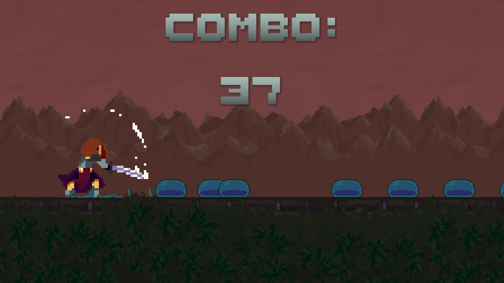

# SlimeBeats

## General info

SlimeBeats ia a small rhythm game made in Unity.

You play as a warrior who is set on a journey to reach the castle. Your objective is to slash as many slimes in your way as you can to the beat of the music and achieve the highest hit combo.

There are two levels available with varying total number of slimes, different music tempo and overall difficulty.

## Technologies

- Unity
- C#

## Controls

- Spece bar - attack

## How to play

The game is available to play in browser or to download on Windows on [itch.io](https://unusualcoding.itch.io/slimebeats). Follow the link for further instructions.

## Credits

Free assets used:

- [Warrior Free Asset](https://assetstore.unity.com/packages/2d/characters/warrior-free-asset-195707?srsltid=AfmBOopBYWSqG6IXrylnZEcwINqyjJPigH2VjMYtpsdhPwFSp2ffAe5O)
- [Slime Enemy - Pixel Art](https://assetstore.unity.com/packages/2d/characters/slime-enemy-pixel-art-228568?srsltid=AfmBOopWBrJlMwxU3Pja-6JIchoZ1maJUDLcdVtkicPtoFFoDYoST94e)
- [Pixel 2D Castle Tileset](https://assetstore.unity.com/packages/2d/textures-materials/tiles/pixel-2d-castle-tileset-135397?srsltid=AfmBOopjMWM4mhrM_z1aqESJho_XM7iP_2kyF56tb_fAwn9mLqsmUr8Q)
- [Platformer Set](https://assetstore.unity.com/packages/2d/environments/platformer-set-150023?srsltid=AfmBOopKuzcDx70h8AAbCxwLe9Hh57tkJmxgKtsyuIO4K7pgO0Dr8FRt)
- [Free Pixel Font - Thaleah](https://assetstore.unity.com/packages/2d/fonts/free-pixel-font-thaleah-140059?srsltid=AfmBOopgaTBbpyV1vcx9zUkx7fYPanT1Ovsjg72KI6rVx8zdCbDxp6Ku)

## Status

Finished with no plans for further updates.
